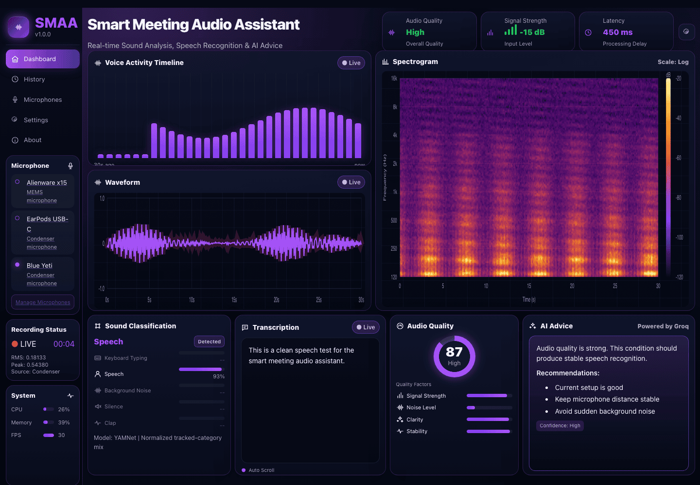

# Smart Meeting Audio Assistant

Real-time microphone dashboard for a class project about how microphone quality, noise, and recording conditions affect speech recognition robustness.



*Streamlit dashboard in mock mode — waveform, spectrogram, voice activity, noise classification, transcript, and audio-quality advice.*

## Goal

Build a GUI-first integration shell that can receive outputs from the rest of the team:

- microphone audio stream
- waveform and spectrogram data
- noise classification labels
- speech transcript
- audio quality metrics
- LLM advice

The dashboard can run now with mock data, so the GUI and integration contract can be prepared before every module is finished.

## Quick Start

```bash
cd src/smart_meeting_audio_assistant
python3 -m venv .venv
source .venv/bin/activate
pip install -r requirements.txt
streamlit run app/dashboard.py
```

Open the mock dashboard:

```text
http://localhost:8501
```

Open live microphone mode:

```text
http://localhost:8501/?mode=live
```

On Lucas's MacBook, the built-in microphone is usually device `1`:

```text
http://localhost:8501/?mode=live&mic=1
```

If the microphone list is different on your computer, open live mode first and select the microphone shown in the left sidebar.

## AI / Model Environment

Use Python 3.11 for the model dependencies. The default Homebrew `python3` on some Macs may be Python 3.14, which is not the right target for TensorFlow/Whisper.

```bash
cd src/smart_meeting_audio_assistant
python3.11 -m venv .venv311
source .venv311/bin/activate
pip install -r requirements.txt
pip install -r requirements-ai.txt
streamlit run app/dashboard.py
```

Open live mode with the built-in MacBook microphone:

```text
http://localhost:8501/?mode=live&mic=1
```

For the smoother no-refresh live UI, run:

```bash
python app/live_web.py
```

Then open:

```text
http://127.0.0.1:8502/?mic=computer&language=auto&model=tiny
```

Use this page for live demos when possible. It keeps the browser page mounted and updates the waveform, VAD timeline, spectrogram, classification, and transcript through small API calls instead of Streamlit full-script reruns.

Useful live URL options:

- `mic=computer` selects the built-in MacBook/PC microphone when available. This is safer than using `mic=0`, because device indexes can change when an iPhone or USB microphone appears.
- `language=auto`, `language=en`, or `language=ja` controls Whisper transcription language.
- `model=tiny`, `model=base`, or `model=small` controls the Whisper model. `tiny` starts fastest; `base` and `small` can be more accurate but load more slowly.

Current behavior:

- VAD runs when `silero-vad` is installed.
- Noise classification runs when TensorFlow and TensorFlow Hub are installed.
- Speech recognition runs in the background on short chunks so the live visuals keep moving while transcript text is appended.

Run the tests with:

```bash
# Run all tests (requires streamlit installed for dashboard tests)
pytest -q

# Run only the audio input unit tests (does not require streamlit)
python3 tests/test_audio_input.py
```

You can also run a live audio capture verification script to test your microphone:

```bash
python3 tests/run_audio_capture.py
```

For the current integration branch and teammate folder ownership, see:

```text
docs/integration_status.md
```

## Project Structure

```text
app/
  contracts.py      Shared data shapes between modules and GUI
  mock_data.py      Simulated real-time system output
  dashboard.py      Streamlit GUI
docs/
  architecture.md   How modules connect
  integration_workflow.md  How teammate code enters the project
  gui_target.md     Screenshot-based GUI target
  team_plan.md      Who should deliver what
  handoff/          One-page instructions for each teammate
```

## Integration Contract

Every module should eventually produce or update part of a `SystemSnapshot`.

```python
SystemSnapshot(
    audio=AudioFrame(...),
    classification=NoiseClassification(...),
    transcript=TranscriptState(...),
    quality=AudioQuality(...),
    advice=AdviceState(...),
)
```

For Week 1, teammates can return dictionaries or Python objects matching the fields in `app/contracts.py`. For Week 2, the integration owner can replace `mock_data.py` with real adapters.

## For Teammates

Do not start by reading every file. Open only the handoff page for your role:

- `docs/handoff/member_1_audio.md`
- `docs/handoff/member_2_visualization.md`
- `docs/handoff/member_3_classification.md`
- `docs/handoff/member_4_transcription.md`
- `docs/handoff/member_5_gui_llm.md`

Each page explains what to build, what input to use, what output to return, and how to test it.

Before accepting teammate files, follow `docs/integration_workflow.md`.
